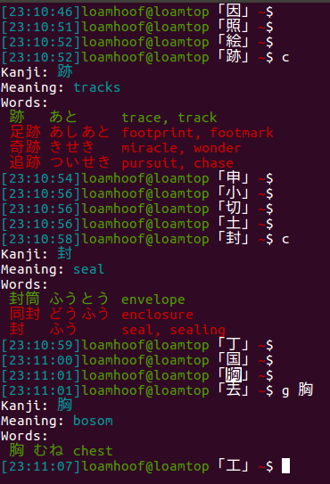

# kanji-prompt
Using my prompt as a tool to review my kanjis

Example
-------

.bashrc

```bash
alias kanji="/home/loamhoof/kanji/kanji.py"
alias c="kanji curr"
alias g="kanji get -k"

function random_kanji() {
  /home/loamhoof/kanji/rand.sh
}

function parse_git_branch () {
  git branch 2> /dev/null | sed -e '/^[^*]/d' -e 's/* \(.*\)/ (\1)/'
}

function parse_date () {
  date | grep -oP '(\d{2}:?){3}'
}

RED="\[\033[0;31m\]"
YELLOW="\[\033[0;33m\]"
GREEN="\[\033[0;32m\]"
BLUE="\[\033[0;34m\]"
CYAN="\[\033[0;36m\]"
NO_COLOR="\[\033[0m\]"
PS1="$CYAN[\$(parse_date)]$GREEN\u@\h$NO_COLOR「\$(random_kanji)」$RED\w$YELLOW\$(parse_git_branch)$NO_COLOR\$ "
```


